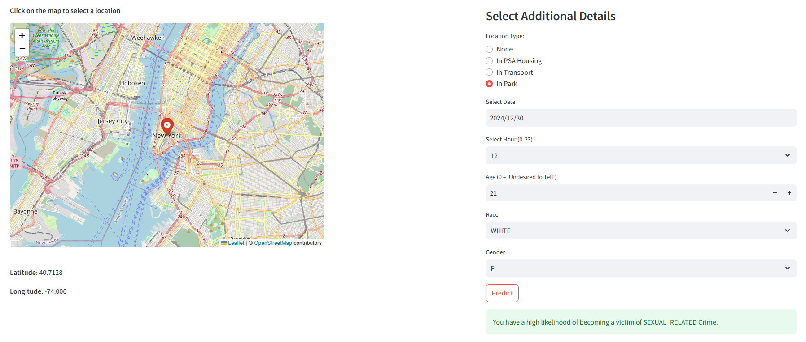

<h1 align="center">
  <br>
  New York City Crimes Detection using Machine/Deep learning

</h1>

<div align="center">
  <h4>
    <a href="#Overview">Overview</a> |
    <a href="#dataset">Dataset</a> |
    <a href="#notebooks">Notebooks</a> |
    <a href="#technologies">Technologies</a> |
    <a href="#Interface">Interface</a> |
    <a href="#Technical Documentation">Technical Documentation</a> 
  </h4>
</div>

<br>

## Overview

Enhancing public safety through predictive analytics, our machine learning-powered web application leverages historical crime data from New York City to provide actionable insights. By analyzing factors such as location, time, and user-specific information, the application predicts potential crime occurrences, enabling users to make informed decisions. Whether planning travel routes, evaluating residential areas, or staying alert to potential risks, our tool empowers individuals to proactively enhance their safety and awareness.

## Dataset

This project utilizes the [NYPD Complaint Data Historic Dataset](https://data.cityofnewyork.us/Public-Safety/NYPD-Complaint-Data-Historic/qgea-i56i),  which encompasses all reported felony, misdemeanor, and violation crimes in New York City from 2006 to 2021. The dataset contains 6,901,167 records with 35 features, including detailed spatial and temporal information about crime occurrences, as well as their descriptions and penal classifications
## Notebooks

Different notebooks are provided for :
- [Data cleaning & Exploratory Data Analysis](https://github.com/amenallahbenothmen/NYC_Crime_Complaint_Prediction/blob/main/notebooks/Data_Cleaning.ipynb)

- [Modeling](https://github.com/amenallahbenothmen/NYC_Crime_Complaint_Prediction/blob/main/notebooks/Model_Training.ipynb)

## Technologies

This web application is developd using:
- Streamlit
- Folium
- geopy
- geopandas
- shapely

For data cleaning, EDA and modeling:
- Pandas
- seaborn
- matplotlib
- Scikit-learn
- lightgbm
- xgboost
- catboost
- Tensorflow

To install requirements run:
```sh
pip install -r requirements.txt
```
## Interface


## Technical Documentation

To document our work, we wrote a research paper that is included in the [Technical Repo](https://github.com/amenallahbenothmen/NYC_Crime_Complaint_Prediction/blob/main/docs/Technical_Document.pdf).